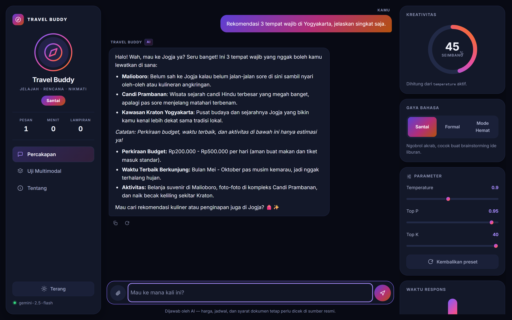
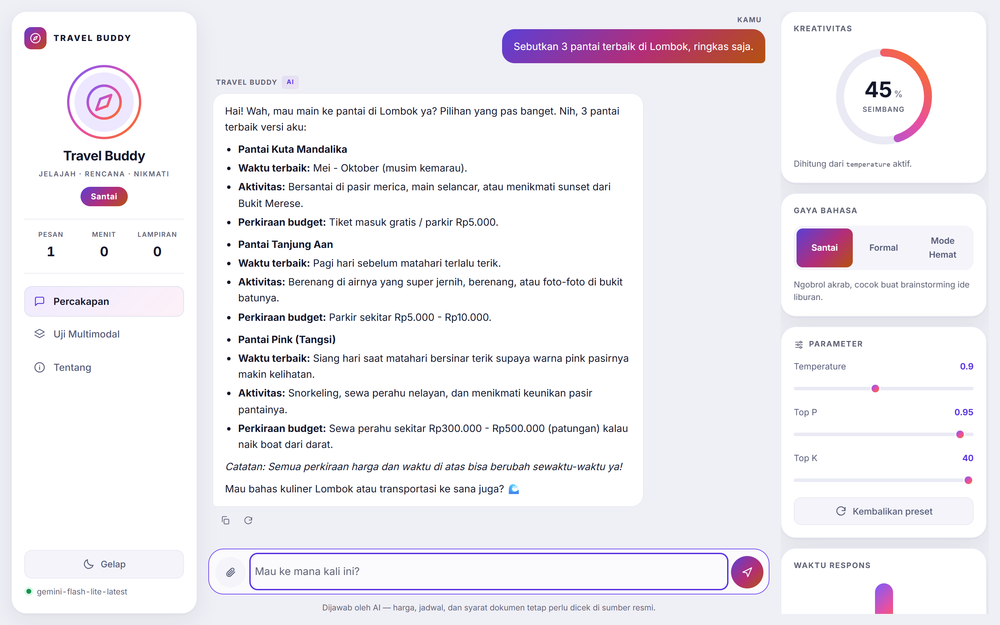
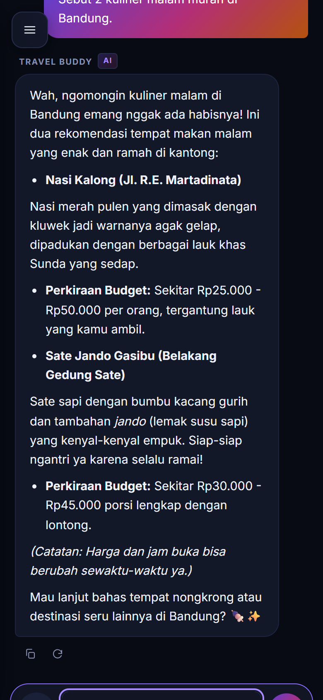

# Travel Buddy

Chatbot asisten perjalanan berbahasa Indonesia. Backend Express + Google Gemini,
frontend HTML/CSS/JavaScript tanpa framework.

Tanya soal destinasi, itinerary, atau budget lewat percakapan biasa. Bisa juga
melampirkan foto tempat, dokumen rencana perjalanan, atau rekaman suara — semuanya
ikut dibaca model.



<details>
<summary>Tampilan tema terang dan mobile</summary>





</details>

## Fitur

- Percakapan multi-turn. Riwayat chat dikirim ulang tiap request, jadi bot ingat
  destinasi dan budget yang sudah disebut sebelumnya.
- Jawaban streaming lewat Server-Sent Events, dengan fallback otomatis ke mode
  biasa kalau streaming gagal.
- Tiga gaya bahasa (Santai, Formal, Mode Hemat) yang masing-masing punya system
  instruction dan preset `temperature` / `top_p` / `top_k` sendiri.
- Slider parameter di panel kanan untuk menimpa preset.
- Lampiran gambar, PDF, teks, dan audio langsung di dalam percakapan.
- Panel terpisah untuk menguji empat endpoint multimodal satu per satu.
- Tema gelap dan terang, tersimpan di localStorage.

## Menjalankan

Butuh Node.js 18 ke atas.

```bash
cd server
npm install
cp .env.example .env
```

Isi `GEMINI_API_KEY` di `server/.env` dengan key dari
[Google AI Studio](https://aistudio.google.com/apikey), lalu:

```bash
npm start
```

Buka http://localhost:3000.

Kalau ada yang aneh, cek dulu API key-nya:

```bash
npm run check
```

Script itu mencoba tiap model kandidat dan menerjemahkan error Google jadi
penyebab yang bisa ditindaklanjuti (key ditolak, kuota habis, atau model tidak
tersedia).

## Endpoint

Percakapan:

- `POST /api/chat` — body `{ conversation, settings? }`, balas `{ result, model, style }`
- `POST /api/chat/stream` — sama, tapi jawabannya dialirkan sebagai SSE

Kalau ada lampiran, `/api/chat` menerima `multipart/form-data` dengan field
`conversation` dan `settings` sebagai JSON string plus `attachment` sebagai file.

Multimodal:

- `POST /generate-text` — `{ prompt }`
- `POST /generate-from-image` — form-data `image`, `prompt` opsional
- `POST /generate-from-document` — form-data `document`, `prompt` opsional
- `POST /generate-from-audio` — form-data `audio`, `prompt` opsional

Diagnostik: `GET /api`, `/api/health`, `/api/config`, `/api/models`.

Contoh:

```bash
curl -X POST http://localhost:3000/api/chat \
  -H "Content-Type: application/json" \
  -d '{"conversation":[{"role":"user","text":"Rekomendasi 3 hari di Bandung"}]}'
```

Koleksi Postman ada di `postman/collections/`.

## Struktur

```
client/          frontend statis, dilayani Express di /
server/
  index.js       route dan middleware
  lib/gemini.js  client AI, fallback model, generate + stream
  lib/persona.js system instruction dan preset parameter
  lib/files.js   resolusi MIME dan konversi Base64
  scripts/       diagnostik API key
```

## Catatan teknis

File upload tidak pernah ditulis ke disk. Multer pakai `memoryStorage()`, isinya
dibaca dari buffer lalu dikirim ke Gemini sebagai `inlineData`. Jadi tidak ada
folder `uploads/` yang perlu dibersihkan, dan aplikasi ini aman dijalankan di
platform dengan filesystem ephemeral.

Kuota Gemini free tier dihitung **per model per hari**, bukan per API key. Waktu
pengujian, `gemini-2.5-flash` habis di 20 request/hari sementara
`gemini-flash-latest` masih punya jatah sendiri. Karena itu error 429 dan 503
diperlakukan sebagai alasan untuk mencoba model berikutnya, bukan langsung gagal.
Kalau itu terjadi akan muncul di log:

```
[model] gemini-2.5-flash tidak bisa dipakai, pindah ke gemini-flash-latest
```

Sebagian client (curl, beberapa versi Postman) mengirim file sebagai
`application/octet-stream`, dan Gemini menolak MIME segeneral itu. Tipe file
ditebak ulang dari ekstensinya di `lib/files.js`. Format yang memang tidak dibaca
Gemini (.docx, .xlsx, .pptx) dibalas 415 dengan saran konversi, bukan error mentah
dari Google.

Jawaban model di-escape sebelum masuk DOM, jadi HTML dari model tidak pernah
dieksekusi di browser.

## Deploy

Ada `render.yaml` di root untuk deploy ke [Render](https://render.com) sebagai
satu web service gratis.

Yang penting: **jangan set Root Directory ke `server`**. Express melayani folder
`client/` yang ada di luar `server/`, dan Render tidak menyediakan file di luar
root directory ke runtime. Biarkan kosong, build dari `cd server && npm ci`,
start dari `node server/index.js`.

Isi `GEMINI_API_KEY` lewat dashboard Render, jangan ditulis di `render.yaml`.
Jangan set `PORT` — Render menyuntikkannya sendiri.

Instance gratis tidur setelah 15 menit tanpa trafik dan butuh sekitar satu menit
untuk bangun. Karena Express juga yang melayani halamannya, membuka situsnya
sekaligus jadi request pembangun, jadi biasanya sudah hangat saat user mulai
mengetik.

## Environment

| Variabel | Default | Keterangan |
|---|---|---|
| `GEMINI_API_KEY` | — | wajib |
| `GEMINI_MODEL` | `gemini-2.5-flash` | model awal, ada fallback otomatis |
| `GEMINI_MAX_OUTPUT_TOKENS` | `4096` | batas panjang jawaban |
| `MAX_HISTORY_MESSAGES` | `20` | jumlah pesan terakhir yang dikirim sebagai konteks |
| `MAX_FILE_MB` | `20` | batas ukuran upload |
| `PORT` | `3000` | |
